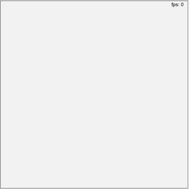

z.shocode.com is an innovative platform that allows developers to write simple game code snippets quickly. In this article, we'll walk beginners and intermediate users through creating very simple game movements to draw and move a rectangle around the screen. A gif of the actions for the game we are going to create is shown below. The full source is given and you can paste the full source code into z.shocode.com. <br/>


The gif shown in this article demonstrates the simple game movements and interactions that will be built. The box is always moving in an x and y direction and reverses direction when a boundary is hit. Mouse clicks immediately bring the center of the box to the click location and if the click is too close to the edge, the box is telported to stay within the boundary. In addtion, the w, a, s, d, q, and e keys can also control the direction of the box.

# Step-by-Step Guide
## Step 1: Create the Rectangle
First, we create a rectangle object that will be animated. The rectangle is defined by its position, size, and colors.

```python
# Step 1: Create the rectangle
r1 = Rect(200, 200, 50, 50, 0, 'blue', 'black')
```
In this code, Rect creates a rectangle r1 positioned at (200, 200) with a width and height of 50 pixels, a rotation angle of 0 degrees, a fill color of blue, and a border color of black.

## Step 2: Set Initial Directions in the Database
Next, we initialize the movement directions for the rectangle in the database object.

```python
# Step 2: Set the initial directions in the database
database.x_direction = 2
database.y_direction = 2
```
This code sets the rectangle to move 2 pixels per frame along both the x and y axes.

## Step 3: Define the OnClick Function
The OnClick function moves the rectangle to the position of a mouse click, with boundaries to prevent it from moving outside the defined area.

```python
# Step 3: Define the OnClick function
def OnClick(mouseX, mouseY):
    # Save the xy position of the user click
    x = mouseX
    y = mouseY
    # If clicking near a wall, keep the box in the boundaries
    if x < (0 + r1.width / 2):
        x = (1 + r1.width / 2)
    elif x > (400 - r1.width / 2):
        x = (399 - r1.width / 2)
    if y < (0 + r1.height / 2):
        y = 1 + r1.height / 2
    elif y > (400 - r1.height / 2):
        y = 399 - r1.height / 2
    # Move the rectangle center to the modified xy position
    r1.x = x
    r1.y = y
```
This function adjusts the rectangle's position based on the mouse click coordinates, ensuring it stays within the 400x400 boundary.

## Step 4: Define the OnKey Function
The OnKey function changes the movement direction of the rectangle based on key presses.

```python
# Step 4: Define the OnKey function
def OnKey(key):
    # Change the database directions when a key is pressed
    # keys: w, a, s, d, q, e
    if key == 'w':
        database.y_direction = 2
        database.x_direction = 0
    elif key == 'a':
        database.x_direction = -2
        database.y_direction = 0
    elif key == 's':
        database.y_direction = -2
        database.x_direction = 0
    elif key == 'd':
        database.x_direction = 2
        database.y_direction = 0
    elif key == 'q':
        database.x_direction = -2
        database.y_direction = 2
    elif key == 'e':
        database.x_direction = 2
        database.y_direction = 2
```
This function maps keys to directions: w for up, a for left, s for down, d for right, q for up-left diagonal, and e for up-right diagonal.

Step 5: Define the OnFrameUpdate Function
The OnFrameUpdate function updates the rectangle's position based on the set directions and reverses direction upon hitting boundaries.

```python
# Step 5: Define the OnFrameUpdate function
def OnFrameUpdate():
    # Move the box based on the database directions set
    r1.x += database.x_direction
    r1.y += database.y_direction
    
    # Reverse direction when hitting the boundaries
    if r1.IsTouching('left-wall') or r1.IsTouching('right-wall'):
        database.x_direction = -database.x_direction
        r1.fillColor = 'red'
    if r1.IsTouching('top-wall') or r1.IsTouching('bottom-wall'):
        database.y_direction = -database.y_direction
        r1.fillColor = 'blue'
```
In this function, the rectangle moves according to the current direction values. If it touches the left or right wall, the x-direction reverses, and the fill color changes to red. If it touches the top or bottom wall, the y-direction reverses, and the fill color changes to blue.

## Putting It All Together
Here's the complete code that combines all the steps above:

```python
# Step 1: Create the rectangle
r1 = Rect(200, 200, 50, 50, 0, 'blue', 'black')

# Step 2: Set the initial directions in the database
database.x_direction = 2
database.y_direction = 2

# Step 3: Define the OnClick function
def OnClick(mouseX, mouseY):
    # Save the xy position of the user click
    x = mouseX
    y = mouseY
    # If clicking near a wall, keep the box in the boundaries
    if x < (0 + r1.width / 2):
        x = (1 + r1.width / 2)
    elif x > (400 - r1.width / 2):
        x = (399 - r1.width / 2)
    if y < (0 + r1.height / 2):
        y = 1 + r1.height / 2
    elif y > (400 - r1.height / 2):
        y = 399 - r1.height / 2
    # Move the rectangle center to the modified xy position
    r1.x = x
    r1.y = y

# Step 4: Define the OnKey function
def OnKey(key):
    # Change the database directions when a key is pressed
    # keys: w, a, s, d, q, e
    if key == 'w':
        database.y_direction = 2
        database.x_direction = 0
    elif key == 'a':
        database.x_direction = -2
        database.y_direction = 0
    elif key == 's':
        database.y_direction = -2
        database.x_direction = 0
    elif key == 'd':
        database.x_direction = 2
        database.y_direction = 0
    elif key == 'q':
        database.x_direction = -2
        database.y_direction = 2
    elif key == 'e':
        database.x_direction = 2
        database.y_direction = 2

# Step 5: Define the OnFrameUpdate function
def OnFrameUpdate():
    # Move the box based on the database directions set
    r1.x += database.x_direction
    r1.y += database.y_direction
    
    # Reverse direction when hitting the boundaries
    if r1.IsTouching('left-wall') or r1.IsTouching('right-wall'):
        database.x_direction = -database.x_direction
        r1.fillColor = 'red'
    if r1.IsTouching('top-wall') or r1.IsTouching('bottom-wall'):
        database.y_direction = -database.y_direction
        r1.fillColor = 'blue'
```
## Conclusion
By following these steps, you can create an interactive animation where a rectangle moves within a boundary, changes direction upon hitting walls, and responds to user inputs. This basic example can be extended to create more complex and engaging animations using the tools provided by z.shocode.com.
