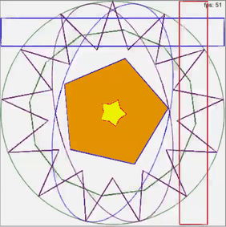

# Introducing a Simple Game Engine for Python Users
Developing a game can be an exciting yet challenging task, especially for those new to programming. However, with the right tools and resources, even beginners can start creating their own games. This is where a simple game engine, designed with Python users in mind, comes into play.



## How was this developed?
I started off by using python3 with the turtle library. As I became more comfortable in Turtle, I started developing some basic shape classes. I wanted to build a small engine that would allow beginers to quickly build some basic games so I started looking at technologies that would allow me to use turtle in a browser. I found Skulpt, which is a javascript port of python with Turtle implementation. It's not a complete port but it's good enough for my case. Besides Turtle, most of the game engine's classes and methods were programmed from scratch. Using the simple code below, users can draw a rectangle to the screen.
```python
# Rect(x, y, width, height, rotation, fillColor, borderColor)
# x,y - center # rotation - degrees rotate clockwise. #optional - rotation, fillColor, borderColor
r1=Rect(200,200, 50, 50,0,'blue','black')
```
By chaning the x and y position, the rectangle can be moved around the screen. The engine supports the following shapes:
- Rectangles
- Circles
- Ovals
- Polygons
- Stars


Here's a nice example of drawing a star on the screen.
```python
'''
Star(x position, y position, radius, points, sharpness, rotation, fillColor, borderColor)
x,y - center # points - number of tips(default 5). sharpeness - between 0 (wide) - 1 (narrow). 
rotation is in degrees clockwise. fillColor, borderColor are optional.
'''
s1=Star(200, 200, 25,5, 0.2, 0, 'yellow', 'red')
```

If you are interested in getting your own projects running right away, I've written a short article on programming simple game interactions and movements in this engine. You can find it at [Building Simple Game Interactions and Movements with z.shocode.com](https://manloloy.github.io/NRTechfolio/essays/gamemovements.html)

## What is a Game Engine?
A game engine is a software framework designed to simplify the development of video games. It provides essential tools and functionalities such as rendering graphics, handling user inputs, managing game states, and more. By using a game engine, developers can focus on the creative aspects of game development rather than dealing with the complexities of low-level programming.

## A Game Engine for All Levels of Python Users
The game engine described here is crafted to be accessible for Python users at all skill levels, from beginners to advanced programmers. Here’s how it caters to different levels:

### For Beginners
- Ease of Use: The game engine offers a user-friendly interface and straightforward API, making it easy for beginners to understand and use. It abstracts many of the complex details, allowing new programmers to get started with game development quickly.
- Small API documentation: The api is small and easy to learn. It only allows you to build a handful of shapes and move them around the screen. There are also only a few important functions you must learn to use to create your first game.
- Sample Code: Sample game code is already given for many simple games on the website. Games like a 1 player pong and tic-tac-toe are already programmed in and the source code is shown.
### For Intermediate Users
- Focus on Game Design: The simplicity of the the game engine allows intermediate users to focus on algorithms and overal game design.
- Extensibility: Users with some experience can extend the engine’s functionalities by inheriting on the basic classes.
### For Advanced Users
- Prototype/Concept: Advanced python programmers can try out some basic 2D concepts before moving to a complete engine. They can experiment with some basic ideas before fully commiting to a large project.
- Accelerated Development: No need to focus on graphics or UI. It's important to be able to test basic concepts first.

## Educational Value
For those learning to code or transitioning into game development, the game engine serves as an excellent educational tool. Working on games can be fun and interactive. In this way, users can enhance their programming skills and gain practical experience.

## Creativity and Innovation
With the technical complexities managed by the game engine, developers can unleash their creativity and innovation. They can experiment with different game ideas, mechanics, and styles without getting bogged down by the intricacies of low-level programming or the overwhelming information that comes with a commercial game engine.

Conclusion
The simple game engine for Python users bridges the gap between the desire to create games and the technical know-how required to develop them. It empowers users of all skill levels to embark on their game development journey, fostering creativity and innovation in the process. Whether you are a beginner eager to create your first game or an advanced user looking to build complex game systems, this game engine provides the tools and support you need to bring your ideas to life.

Try it out for yourself at the website below. I recommend using the drop down to explore the following code:
- Shapes
- Crazy Shapes
- Events
- 1 Player Pong
- Tic-Tac-Toe
<br/>
Website: <a href="https://z.shocode.com"><i class="fa-solid fa-browser"></i>z.shocode.com</a>

