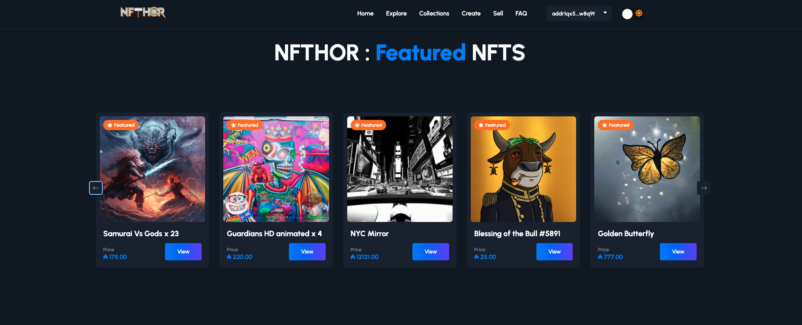

  
  

# NFThor.io Project Summary
I've developed this NFT Marketplace by levaraging NextJS, Cardano Smart Contracts, and other open source tools.
NFThor.io is an innovative platform designed to leverage blockchain technology for the creation, trading, 
and management of Non-Fungible Tokens (NFTs). The project aims to provide a user-friendly and secure environment 
where artists, collectors, and enthusiasts can engage with digital assets in new and exciting ways. 
Here are the key aspects of the NFThor.io project:

1. User-Friendly Interface: NFThor.io prioritizes ease of use, making it accessible for individuals with varying 
levels of technical expertise. The platform features intuitive tools for creating, buying, and selling NFTs.

2. Smart Contracts: Using smart contracts, NFThor.io ensures that all transactions and asset ownership records
are immutable and transparent. This reduces the risk of fraud and enhances user trust.

3. Diverse Marketplace: The platform supports a wide range of digital assets, including art, music, collectibles, 
and more. This diversity allows users to explore and invest in different types of NFTs according to their interests.

4. Community Engagement: NFThor.io fosters a vibrant community where creators and collectors can interact, collaborate, 
and support each other. This community-centric approach helps drive the growth and adoption of the platform.

5. Royalties and Revenue Sharing: Artists and creators can set royalties on their NFTs, ensuring they receive a share of 
the revenue every time their work is resold. This feature supports sustainable income for creators and incentivizes ongoing participation.

NFThor.io is dedicated to pushing the boundaries of what is possible with NFTs, providing a robust platform that supports innovation and 
creativity in the digital space.

